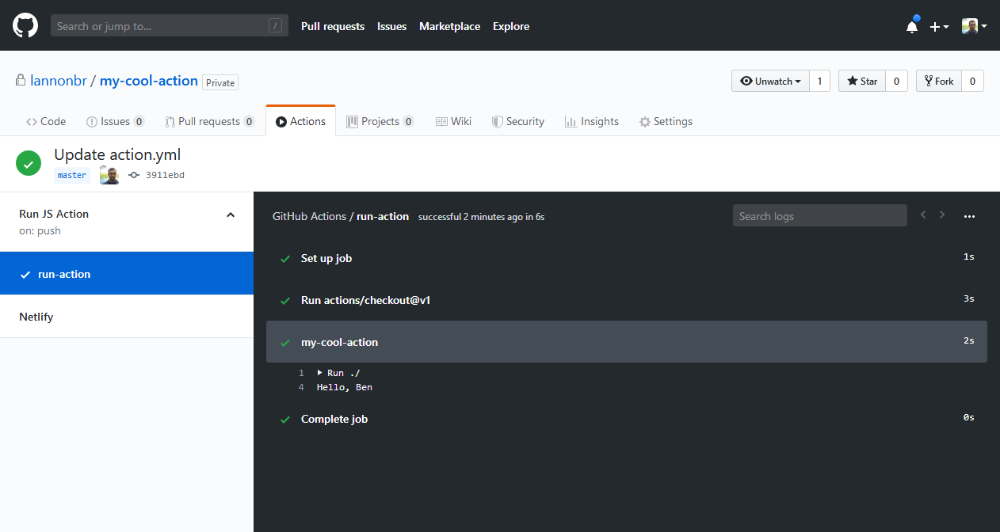

GitHub announced on August 8 a new beta of GitHub Actions including CI & CD support. I want to look into a variety of new features added into the new beta and capabilities they can do.

This post will look into the new "JavaScript Actions", which allows you to build new actions by just writing JavaScript.

## Repo setup & action.yml

We can start out creating a JS Action by creating a directory where our action will live.

```shell
mkdir my-cool-action
```

Next, a file needs to be generated to describe some metadata for the particular action. Create a file named `action.yml` and fill it in with the following:

```yml title=action.yml
name: My Cool Action
author: Benjamin Lannon
description: 'Action that does some cool stuff!'
inputs:
  name:
    description: 'Name'
    required: false
    default: 'Benjamin'
runs:
  using: 'node12'
  main: 'main.js'
branding:
  color: 'green'
  icon: 'send'
```

The details for the YAML syntax can be found on GitHub's docs here: [action.yml syntax docs](https://help.github.com/en/articles/metadata-syntax-for-github-actions). It is the file that will allow GitHub to know what file to look for when developing. The main things required are:

- `name`: Gives your action a name.
- `description`: Gives an explanation of what the action is going to do.
- `runs.using`: tells you what kind of action it is. It currently supports either `docker` for container based actions, or `node12` which is what we are using for JS based actions.
- `runs.main`: When using `node12` in `runs.using`, this param defines where your entrypoint is going to be located in the current directory.

As well, a field that is optional but good to look at is the `inputs` field which defines inputs to the action. all of the IDs will be translated to an environment variable as `INPUT_` followed by the ID in uppercase (ex: `name` will be available as `INPUT_NAME`).

Next, we can create a main.js file to actually run some JS as part of an action.

```js title=main.js
let name = process.env.INPUT_NAME

console.log(`Hello, ${name}`)
```

This is an extremely basic example that gets a field from the action and logs out to the console, but it proves that all you need to do to get started with JS Actions is a single yaml file and a JS file.

## Inserting into a GitHub Actions Workflow file

Next, I am going to create a workflow that will use this action. I pushed this repo to GitHub so we can prepare to create the workflow.

Next, we want to create a workflow file. It will live in the `.github/workflows` directory.

```yml title=.github/workflows/main.yml
name: Run JS Action
on: push
jobs:
  run-action:
    runs-on: ubuntu-latest
    steps:
      - uses: actions/checkout@v1
      - name: my-cool-action
        uses: ./
        with:
          name: 'Ben'
```

Going step by step down the file, we describe the workflow, when to execute, and what to execute

`name` gives a name for this workflow at large.

`on` describes the event(s) that this action will run on. Here we chose `push` which happens any time a new commit is pushed to the repo. There's a large list of [Event Triggers](https://help.github.com/en/articles/events-that-trigger-workflows) in the docs that will start workflows.

`jobs` then defines the set of jobs we need to run in the workflow. Currently we just want to run one job, so we create a single entry and give it an id of `run-action`.

In this job, we define the environment we want to run it in using the `runs-on` field. Here we choose `ubuntu-latest` (which at the time is the newest LTS, 18.04), but we can also run it on `windows` or `macos` if we so choose. You can learn here on the [Virtual Environments](https://help.github.com/en/articles/virtual-environments-for-github-actions) that your actions run in.

Following, each job has a series of steps you want to run. The first step is fetching the repo down and checking out into it using an action built by GitHub called [actions/checkout](https://github.com/actions/checkout). Each step has a `uses` field which tells where to find an action. This can include relative paths in the same repo, owner/repo strings (including tags or commit SHAs), paths to a Dockerfile, or even docker images on a registry, and plenty of variations of all of these as defined further in the [Actions Docs](https://help.github.com/en/articles/workflow-syntax-for-github-actions#jobsjob_idstepsuses)

Our second step is going to use our action. The relative path for the `uses` field starts at the root of the repo, and given we dropped the `action.yml` file in the root, which is how GitHub finds a JS action, we set the `uses` field to `./`. With it as well, we want to pass in our inputs which we can do using the `with` field which is a series of entries that match to the `inputs` in our `action.yml` file.

For other information about the syntax for workflow files, head over to the [Workflow syntax for GitHub Actions](https://help.github.com/en/articles/workflow-syntax-for-github-actions) page in the docs.

If we finally commit this file, it will trigger a `push`, and such trigger the workflow itself. If you see below, GitHub provides a UI which we can see all of our jobs running and with such, the action we built works!



## Follow up

This was an introduction to setting up a JS Action with the new GitHub Actions and creating a workflow. In future posts, I will dive into other new features around GitHub Actions Beta 2 and what we can create with them. Up next, I will follow this article up with creating more advanced actions that interact with GitHub's API using some libraries the Actions team made that makes writing actions easier to manage. Stay tuned.
