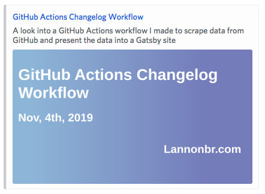

I had a simple goal. I wanted to add some style to the embed cards for my blogposts Twitter injects for links with their meta tags. With this, I approached it using a Gatsby plugin by [Chris Biscardi](https://twitter.com/chrisbiscardi) to create a React component so I could create the image programmatically as part of my Gatsby build process.

## gatsby-plugin-printer

Chris wrote a plugin named [gatsby-plugin-printer](https://www.npmjs.com/package/gatsby-plugin-printer) which provides an API to generate images out of React components you build.

To start out, download the plugin and add it to your `gatsby-config.js` file.

```sh
yarn add gatsby-plugin-printer@1.0.8
```

```js title=gatsby-config.js
module.exports = {
  plugins: [`gatsby-plugin-printer`],
}
```

You will notice I am using a specific version of said plugin as there is a newer version but Puppeteer which is used in the plugin had a major update on how they manage screenshots. Hopefully in the near future there will be an update for this plugin that fixes such, but for the time being, I am pinning to `1.0.8`.

I already have a setup of MDX files being generated and managed. Now in `gatsby-node.js` file, a `Printer` node can be created using the `createPrinterNode` function from `gatsby-plugin-printer`.

```js title=gatsby-node.js
exports.onCreateNode = ({ node, actions, getNode }) => {
  // create printer nodes only on MDX nodes that are blogposts
  if (
    node.internal.type === 'Mdx' &&
    node.fileAbsolutePath.includes('/blog/')
  ) {
    // get the folder name (ex: /blog/2019-11-04-github-actions-changelog-workflow/index.md -> 2019-11-04-github-actions-changelog-workflow)
    let filePathSplit = node.fileAbsolutePath.split('/')
    let fileName = filePathSplit[filePathSplit.length - 2]

    createPrinterNode({
      id: node.id,
      fileName, // the filename of the image to be generated
      outputDir: 'og-images/blog', // relative to the 'public' folder.
      data: {
        // The data you wish to pass down to the react component to be rendered
        title: node.frontmatter.title,
        date: moment(node.frontmatter.date).format('MMM, Do, YYYY'),
      },
      component: require.resolve('./src/printer-components/blogpost.js'), // the react component to be used.
    })

    // create a field to be then used later on for usage
    actions.createNodeField({
      node,
      name: 'ogFileName',
      value: fileName,
    })
  }
}
```

The blogpost printer component then gets the fields in the `data` param as props.

```js title=src/printer-components/blogpost.js
import React from 'react'

const BlogPostComponent = ({ date, title }) => {
  return (
    <div
      style={{
        width: 1280,
        height: 720,
        padding: 30,
        paddingBottom: 0,
        boxSizing: 'border-box',
        overflowX: 'hidden',
        backgroundImage: 'linear-gradient(270deg, #747dbc 21%, #8CB5D9 92%)',
        color: 'white',
        fontFamily: 'Arial, Helvetica, sans-serif',
      }}
    >
      <div
        style={{
          fontSize: 60,
          display: 'flex',
          flexDirection: 'column',
        }}
      >
        <h1
          style={{
            fontSize: '1.4em',
            marginBottom: 0,
          }}
        >
          {title}
        </h1>
        <h2 style={{ fontSize: '1em', flexGrow: 1 }}>{date}</h2>
        <h2 style={{ fontSize: '1em', textAlign: 'right', marginRight: 30 }}>
          Lannonbr.com
        </h2>
      </div>
    </div>
  )
}

export default BlogPostComponent
```

After everything is set, `gatsby-plugin-printer` will then generate some react components with the data that is passed down. During the build process, it will compile down those components with Rollup and Babel into a bundle that is passed into a Puppeteer browser instance. As I set the main container to be 1280x720px, it will then generate an image of that size with Puppeteer.

Finally, in my template, I can pass that `ogFileName` field I created in `gatsby-node` into the template with a GraphQL query. Once it is available, I can pass the content into a [react-helmet](https://www.npmjs.com/package/react-helmet) component to tell sites like Twitter that I want an embed and where to find the images.

```jsx title=blogpostTemplate.js
<Helmet
  meta={[
    {
      name: `twitter:card`,
      content: 'summary_large_image',
    },
    {
      name: `twitter:title`,
      content: data.mdx.frontmatter.title + ' | Benjamin Lannon',
    },
    {
      name: `twitter:image`,
      content: `https://lannonbr.com/og-images/blog/${ogFileName}.png`,
    },
    { name: `twitter:site`, content: `@lannonbr` },
  ]}
/>
```

## Results

Once all of this is done and live, Twitter will now render the blogpost links as card embeds.


Also given Open Graph is a public standard, other platforms like Discord have also implemented this in their clients:



Although this is done with Gatsby, it can be extrapolated out to use other frameworks or no framework at all as you just have to generate some HTML that will be rendered in a chrome window to take the screenshot.

For more info on what is available in OpenGraph, take a look at their main site: https://ogp.me/
