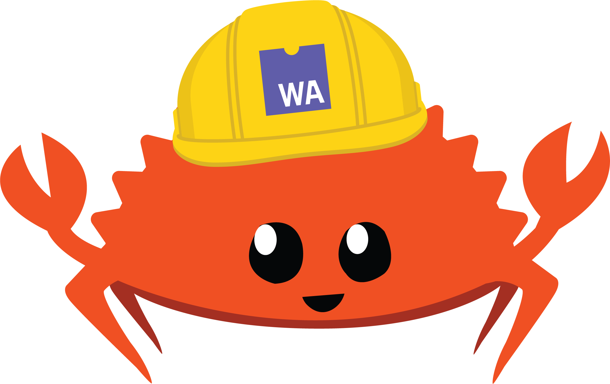

With the release of WebAssembly into stable releases of web browsers, it provides a runtime for compiled languages like C++, Go, Rust, and others to run in the browser. Across many languages, Rust has a good amount of support to start building rust libraries to be compiled down to WASM. With such, it is a fairly small amount of code to get a hello world project up and running with a tool made by the rust community, wasm-pack.

## Project setup

To start, make sure to install Rust & Cargo, the language and package manager respectively. To do such, [rustup](https://rustup.rs/) is a good solution to get things installed on your platform of choice.

Once Rust is installed, you can setup a new project using `cargo` as follows:

```sh
cargo init --lib hello-wasm
```

Notice the `--lib` so it will setup a library instead of a binary application. Next, you will want to add some fields to the cargo.toml file in the repo that was just created.

```toml title=cargo.toml
[package]
name = "hello-wasm"
version = "0.1.0"
authors = ["Benjamin Lannon <benjamin@lannonbr.com>"]
edition = "2018"

# See more keys and their definitions at https://doc.rust-lang.org/cargo/reference/manifest.html

[lib]
crate-type = ["cdylib"]

[dependencies]
wasm-bindgen = "0.2"
```

you will want to setup the `crate-type` to be `cdylib` to be built as a dynamic library at compile time. As well, you will want to pull down the `wasm-bindgen` crate as a dependency of this library.

To start, you can write a simple function that adds two integers together and returns them.

```rust title=src/lib.rs
extern crate wasm_bindgen;

use wasm_bindgen::prelude::*;

#[wasm_bindgen]
pub fn add(a: i32, b: i32) -> i32 {
    a + b
}
```

the `extern crate` line tells rust it will be using a crate called `wasm_bindgen` which is the one you added to the cargo.toml file earlier. The `use` pulls in various things from the crate, but mainly the `#[wasm_bindgen]` attribute which will specify which functions should be exported and be public function available from the WASM bundle.

To compile the library, wasm-pack will offer a toolchain to make it easier to work with the WASM binary. You can compile it with the default `rustc` compiler, but there is a portion of boilerplate to setup the WASM environment and be able to convert various types to be available in Rust.

To install wasm-pack, run the following:

```
curl https://rustwasm.github.io/wasm-pack/installer/init.sh -sSf | sh
```

Then in the root project folder, compile with the `wasm-pack` command. you can output it to be used in various targets like the browser, Node.JS, and others. Start with web.

```
wasm-pack build --target web
```

In the newly created `pkg` folder, the outputted WASM file now exists. On top of such, `hello_wasm.js` is glue code to spin up the wasm environment.

As it is exported as a ES Module, you can load it in a html file in a script tag with the `type="module"` attribute to declare the inline script as an ES Module. Then, if you import the `pkg/hello_wasm.js`, it provides an init default function and the function you declared in rust.

```html
<script type="module">
  import init, { add } from 'pkg/hello_wasm.js'
  ;(async () => {
    await init()
    console.log(add(2, 2)) // Outputs 4!
  })()
</script>
```

The `init` function is asynchronous which is why it is awaited, but after it finishes, you can use the `add` function. If you spin up a web server and load this html file, you will see the `add` function run and output the value in the console.

You just wrote your first Rust library that compiles to WASM. It is primitive but shows portions of the code that are necessary across any Rust program that you want to compile to WASM. To learn more, visit the [wasm-pack](https://rustwasm.github.io/docs/wasm-pack/) and [wasm-bindgen](https://rustwasm.github.io/docs/wasm-bindgen/) docs for full information on the two tools.
